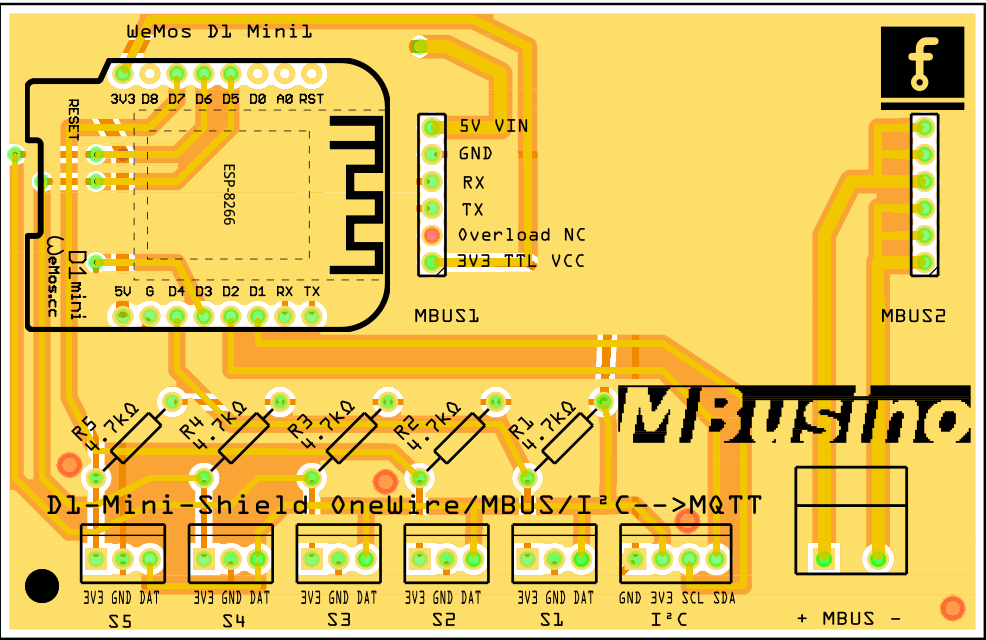

# MBusino
Ein ESP8266 D1 Mini Shield zur Aufnahme verschiedener Messwerte und deren Versand per MQTT

- M-Bus z.B. Wärmemengenzähler 
- OneWire 5x z.B. DS18B20, Temperatur
- I²C z.B. BME280, Temperatur, rel. Luftfeuchte, Luftdruck

## Hardware
Das Shield ist ein mit Fritzing konstruiertes Board.
Der M-Bus wird über einen aufsteckbaren M-Bus Master bereitgestellt.
https://de.aliexpress.com/item/33008746192.html --> der Master!

Ausser der USB Spannungsversorgung des D1 Mini ist kein weiteres Netzteil nötig.

## known issues
- Flashen über USB ist nur möglich, wenn der MBus Master nicht aufgesteckt ist. OTA Update geht aber.

- Das Projekt befindet sich im Aufbau. Der Code ist funktionsfähig. M-BUS ist bis jetzt nur mit dem Sensostar U implementiert.

- Beim aktuellen Prototypen ist die Beschriftung von 3V3 und DAT bei den OneWire Sensoren vertauscht (S1-S5).

## Danke
Der M-Bus Teil und die Headerdateien sind ein Extrakt aus https://github.com/NerdyProjects/HousebusNode_Heatpump
Danke an User NerdyProjects 

## Lizenz
****************************************************
This program is free software: you can redistribute it and/or modify it under the terms of the GNU General Public License as published by
the Free Software Foundation, either version 3 of the License, or (at your option) any later version. This program is distributed in the hope that it will be useful,
but WITHOUT ANY WARRANTY; without even the implied warranty of MERCHANTABILITY or FITNESS FOR A PARTICULAR PURPOSE.  See the GNU General Public License for more details.
You should have received a copy of the GNU General Public License along with this program.  If not, see <http://www.gnu.org/licenses/>.
****************************************************

