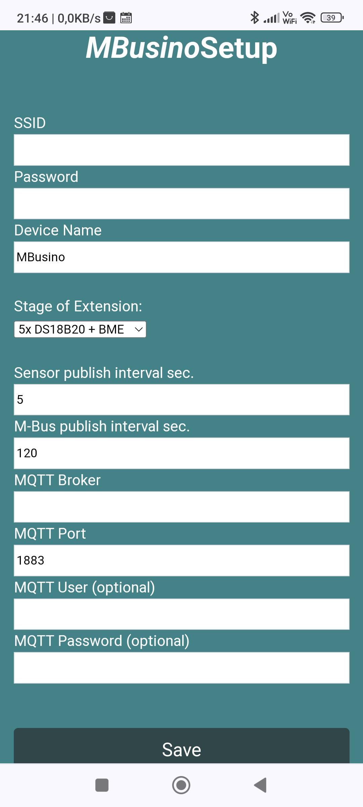
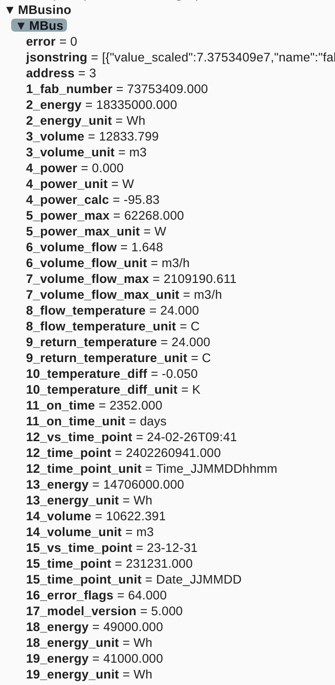
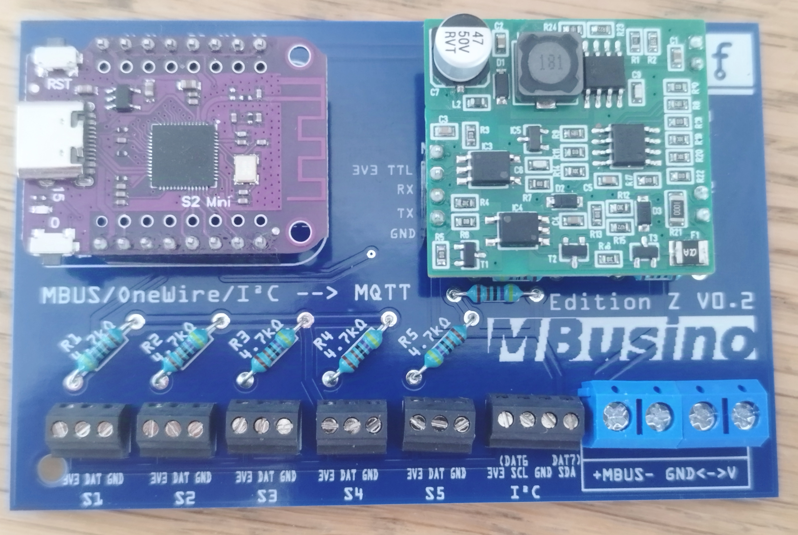
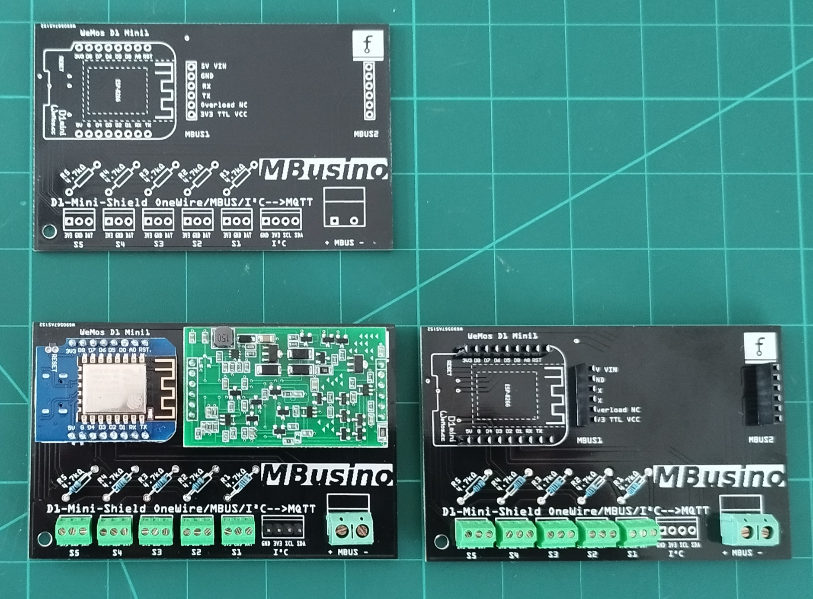
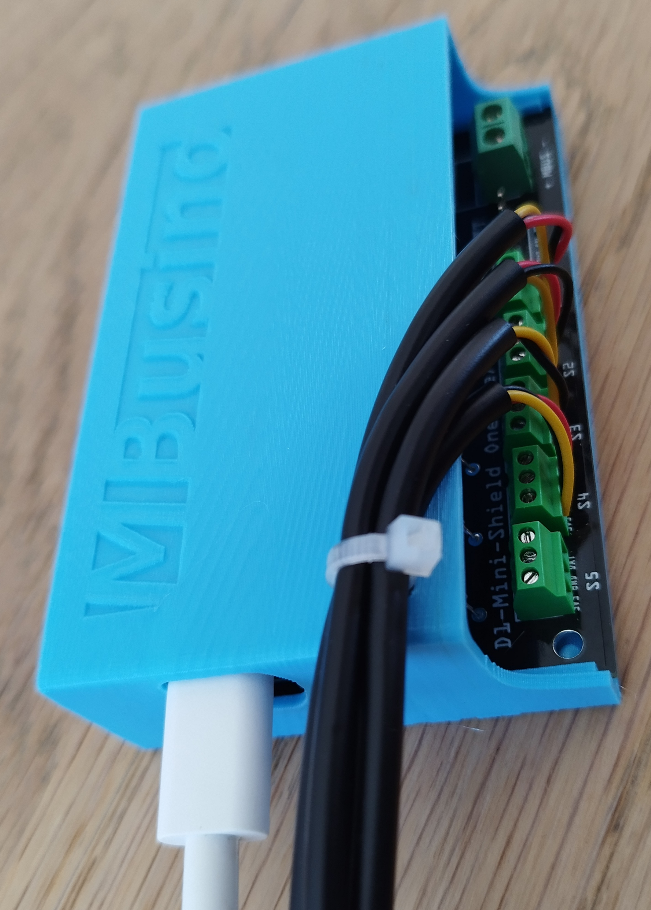

# MBusino
 
### M-Bus/OneWire/I²C --> MQTT-Gateway with a shield for ESP8266 D1 mini or ESP32 S2 mini
A **Plug and Play** solution.

- M-Bus e.g. heatmeter (up to three slaves)
- OneWire 5x e.g. DS18B20, temperature
- I²C e.g.. BME280, temperatur, r. humidity, air pressure

M-Bus decoding use the project's own library [**MBusinoLib**](https://github.com/Zeppelin500/MBusinoLib). Test the library [**via Wokwi.**](https://wokwi.com/projects/402235052803622913)

Mbusino has a captive and setup portal to configure WiFi, MQTT, M-Bus, and Sensors.
The Board is usable for "only M-Bus" or "only sensor meassuring" as well.  

## Access Point to configure,  MBusino Setup Portal

* SSID **MBusino Setup Portal** IP(normally not needed): 192.168.4.1
* If Mbusino do not find a known network, he start an AP for 5 minutes. After this period, he will restart and search again.
* In known networks, you will find the IP of the portal under **MBusino** in your router.

## MQTT Output

### Home-Assistant

If you use Home Assistant, MBusino supports autodiscover. You need only the MQTT integration and MBusino will be find as device with all records.
Every 256th record message is a autodiscover message. 
If you use not Home Assistant, no matter. All records will be send as MQTT message.

## Hardware
M-Bus is provided by a piggyback M-Bus master.
Supported ESP-Boards: ESP8266 D1 mini, or D1 mini Pro(4M) with extern antenna for better Wifi range and the ESP32 S2 mini

There are two versions aviable for two different M-Bus masters.

The "old" version for a chinese M-Bus Master. 
https://a.aliexpress.com/_EyQhgIZ --> the Master **NOT the Slave!** 
All three esps are supported

The new "**edition Z**" version for a german M-Bus master from Zihatec. Many thanks to HWHardsoft for making the board available especially for us.
https://www.hwhardsoft.de/2024/10/08/m-bus-master-breakout
Work only with the ESP S2 mini.

Beside the USB power supply of D1 mini is no other adapter necessary.

Use 2,54mm terminals or JST XH to connect the DS18B20

You will find a 3D-printable PCB case inside the case folder. The edition Z need a different case. ()Not released yet)  
The PCB is designed with fritzing.

To save mony, I place omnibus orders for all parts beside the M-Bus Master.

## calibration capabilities 

Most DS18B20 are faked and out of specifications.
You can calibrate the sensors by sending a MQTT message to MBusino.
Subscribe at topic MBusino/cal/# for calibration replies. 

### 1. Set the average of all DS sensors
* MQTT Topic: MBusino/calibrateAverage
* MQTT Payload: no matter

Make the average of the connected sensors and add an offset to every sensor. After the calibration, all sensors will show the same value.
You have to bring all connected sensors to the same environment, wait a little bit and send the calibration message.

### 2. Calibrate to a connected Bosch BME280 Sensor
* MQTT Topic: MBusino/calibrateBME
* MQTT Payload: no matter

Make an offset for every DS sensor based at the meassured value of the BME sensor. After the calibration, all sensors will show the same value.
You have to bring all connected sensors to the same environment, wait a little bit and send the calibration message.

### 3. Calibration by hand
* MQTT Topic: MBusino/calibrateSensor
* MQTT Payload: Number of the Sensor to calibrate (only the number). e.g.S3 = 3
* MQTT Topic: MBusino/calibrateValue
* MQTT Payload: a float number e.g. -0.15

Manipulate the offset of a single sensor by sending sensor numbers and values. The transmitted value will be added to the current offset. First chose the sensor, then send the value. If a sensor is chosed, multiple manipulations of the same sensor are possible.

### 4. Set all offsets to zero
* MQTT Topic: MBusino/calibrateSet0
* MQTT Payload: no matter

Self explanatory.

## known issues
- Flashing over USB is only possible, if the M-Bus master is not connected. OTA update work fine.

- Do not use 2 Boards simultaneously without changing thr Name or it cause in network problems, both boards becomes unreachable. 

- M-Bus is tested with a "Engelmann Sensostar U" and some other slaves, it should work with most M-Bus devices. If you have M-Bus issues, let me know.

## Credits
* AllWize for the MbusPayload library -- the first code base of the MBusinoLib to decode M-Bus
* HWHardsoft and TrystanLea for the M-Bus communication

## Current topics

https://github.com/Zeppelin500/MBusino/discussions

## Tutorial

https://github.com/Zeppelin500/MBusino/tree/main/tutorial

## Licence
****************************************************
This program is free software: you can redistribute it and/or modify it under the terms of the GNU General Public License as published by
the Free Software Foundation, either version 3 of the License, or (at your option) any later version. This program is distributed in the hope that it will be useful,
but WITHOUT ANY WARRANTY; without even the implied warranty of MERCHANTABILITY or FITNESS FOR A PARTICULAR PURPOSE.  See the GNU General Public License for more details.
You should have received a copy of the GNU General Public License along with this program.  If not, see <http://www.gnu.org/licenses/>.
****************************************************

